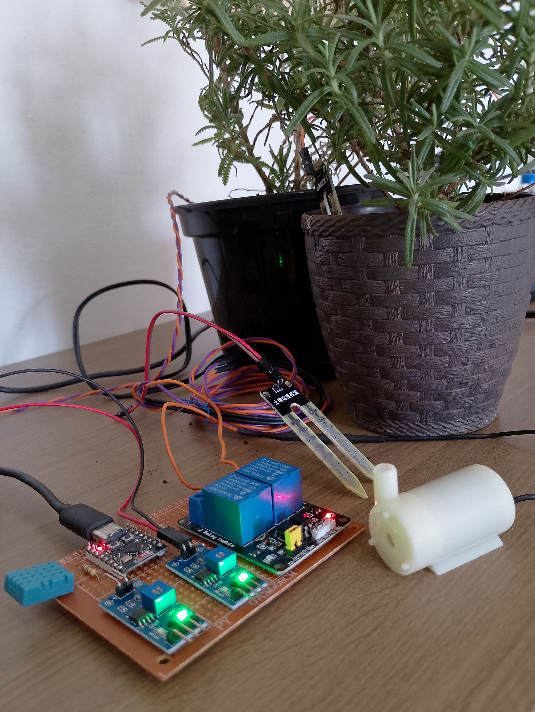
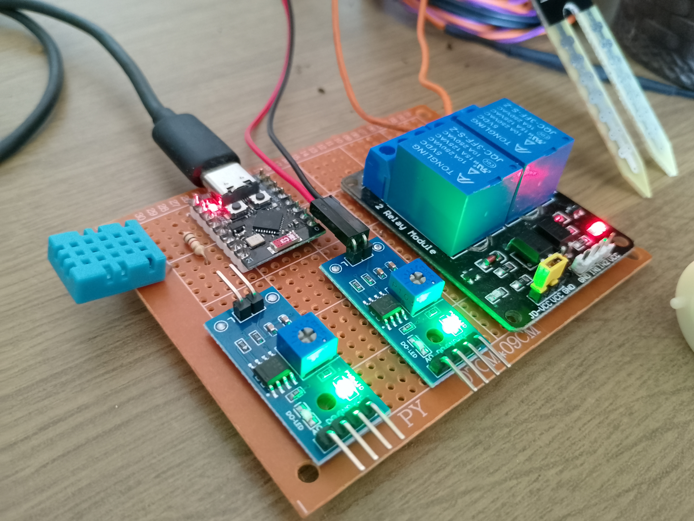

# automatic-irrigation-ESP32
This project consist of an automated irrigation system using an ESP32 development board, a relay module and a peristaltic pump. The system allows efficient control of water flow for plant irrigation and can be configured to work automatically based on humidity sensor or manually via the control interface.

## Components Overview
This section provides a detailed description of the main electronic components used in the automatic irrigation system. These components were selected to enable soil moisture sensing, environmental monitoring, and water pump control using a compact and efficient microcontroller. Below, each module is presented with its key technical characteristics and intended functionality.

### Channel Relay Module (5V, 10A)
Used to control the water pump based on soil moisture readings.

- Operating voltage: 5V DC
- Channels: 2
- Maximum current per channel: 10A @ 250V AC, 10A @ 125V AC  or 10A @ 30V DC
- Isolation: Optocoupler between control and power circuits
- Trigger logic: <b>Active LOW</b> (relay turns on when input is LOW) 
- Pins: IN1, IN2, VCC, GND

Note: Requires stable 5V power supply for reliable switching

### Resistive Soil Moisture Sensors (x2)
Used to monitor soil moisture levels and determine irrigation needs.

- Sensor type: Resistive (conductivity-based)
- Operating voltage: 3.3V to 5V
- Analog output: Voltage proportional to soil moisture
- Typical reading range (12-bit ADC):
- Dry: ~4000
- Wet: ~1300 (subject to calibration)

Limitation: Prone to corrosion with prolonged exposure to moisture.

### DHT11 Temperature and Humidity Sensor
Monitors the ambient environment for basic climate control.

- Sensor type: Digital
- Operating voltage: 3.3V to 5V
- Temperature range: 0–50 °C (±2 °C accuracy)
- Humidity range: 20%–90% RH (±5% RH accuracy)
- Sampling rate: 1 reading per second
- Communication: Proprietary single-wire digital protocol (Arduino/DHTesp compatible)

Note: Requires a 10kΩ resistor

### ESP32-C3 SuperMini Development Board
The core controller responsible for sensor management and relay control.

- Microcontroller: ESP32-C3 (32-bit RISC-V, single-core)
- Clock speed: Up to 160 MHz
- Connectivity: Wi-Fi 2.4 GHz + Bluetooth Low Energy (BLE 5.0)
- RAM: 400 KB SRAM
- Available GPIOs: ~15, supporting ADC, PWM, I²C, SPI, UART
- Operating voltage: 5V

# Prototype hardware setup

